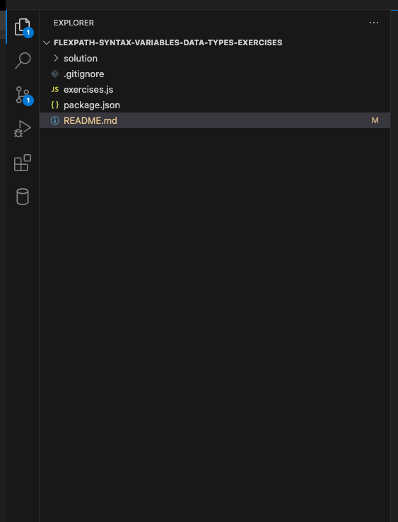
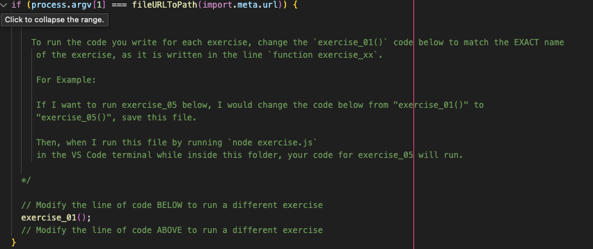

# flexpath-syntax-variables-data-types-exercises

## Exercise overview

The intention of this exercise is to give you more experience the syntax of the 
JavaScript language and using its data types.

## Getting Started

1. Using Visual Studio Code, open the folder `flexpath-syntax-variables-data-types-exercises` 
   wherever you saved it on your device. 
2. Your VS code file explorer window should look like this:
    
3. Then open up the `exercises.js` file in the `flexpath-syntax-variables-data-types-exercises` folder. 
   Inside of this file we have provided exercises for you to complete, written 
   in code comments. For each exercise, please code ONLY in the space 
   between the comments `// CODE IN THE OPEN LINES BELOW` and `// CODE IN THE OPEN LINES ABOVE` 
4. To run your code for different exercises, you will update the exercise mentioned
   on line 20 of the file. 
   
5. After changing that line, make sure to SAVE the file before running it.
6. To run your code in exercises.js, you will update line 20 to run the exercise code
   you want to run and save the file. THEN, open a Terminal window in VS Code 
   by going to your toolbar at the top of the page and selecting 
   "Terminal" -> "New Terminal"
7. Inside of this terminal, check that you have Node.js installed by running the 
   command `node -v`. If your computer doesn't recognize that keyword, please
   go back and ensure you installed Node.js correctly.
8. To run `exercises.js` you will then use the command `node exercises.js` in the
   terminal to run the file.

We have included a screen recording showing this process in the file
`run-exercise-recording.mp4` in this repo.

Exercise solutions are in the `/solution` folder

&nbsp;
---

### Summary of JavaScript Concepts Covered in These Exercises

1. **JavaScript Syntax**:
    
    - Rules for writing valid JavaScript code.
    - Use of semicolons and how automatic semicolon insertion works.
2. **Variables and Keywords**:
    
    - Declaring variables using `let`, `const`, and `var`.
    - Best practices for naming variables, including camel case.
3. **Data Types**:
    
    - Primitive types: `Boolean`, `Number`, `String`, `BigInt`, `Symbol`, `Null`, and `Undefined`.
    - Objects and how they differ from primitive types.
    - Dynamic typing in JavaScript.
4. **Operators**:
    
    - Arithmetic operators, assignment operators, and the `typeof` operator.
5. **Comments**:
    
    - Using single-line and multi-line comments.
    - The role of comments in code readability and documentation.
6. **Memory Management**:
    
    - Concepts of stack and heap.
    - Garbage collection and automatic memory management.
7. **Strings**:
    
    - String creation and manipulation.
    - Template literals and string methods like `toUpperCase`, `indexOf`, and `includes`.
8. **Boolean Values**:
    
    - Using `true` and `false` and the `!` (not) operator.
    - Understanding truthy and falsy values.
9. **Numbers and BigInt**:
    
    - Number representation, precision limits, and e-notation.
    - Using `BigInt` for large integers.
10. **Null and Undefined**:
    
    - Differences between `null` and `undefined`.
    - Using `typeof` to check variable types.
11. **Objects**:
    
    - Creating objects using object literals and constructors.
    - Accessing, modifying, and deleting object properties.
    - Passing objects by reference vs. passing primitives by value.
12. **Date Object**:
    
    - Creating and manipulating dates.
    - Methods for accessing parts of a date, such as `getFullYear`, `getMonth`, `getDate`, etc.
    - Understanding how JavaScript stores dates as milliseconds since the epoch.
